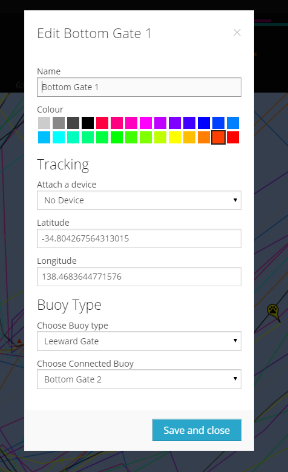

# Setting up a race course

YachtBot racing is at its best when plenty of context is provided: who are the competitors, what is the wind doing, where is the start line?

  

In this article, we focus on setting up buoy objects in the race editor. Whether you use them at all, enter fixed long/lat values or trackers for them is up to you. In YachtBot viewer, a buoys' icon is a triangle, and the following function (i.e. the automatically panning map) ignores them.

  

Generic Mark
------------

Use a generic mark for landmarks you want labeled, support, safety and pace boats. Note that buoys don't show a name label, so use colours to distinguish your objects.

  

Marks
-----

You have the option to set Reaching, Windward, and Leeward Marks. All three display set leylines when manual or live wind is set.

  

Gates  

Windward and leeward gates are set up by creating two objects for each gate, then linking them together with the 'Choose Connected Buoy' option.

  

Start line
----------

For a start line, you need two objects (tracked or stationary). One is set to buoy type 'committee boat' and the other to 'pin'. Then link them together using the 'Choose Connected Buoy' option. Remember that you only see sensible leylines in the viewer if your manual wind is set correctly, or you are measuring live wind.