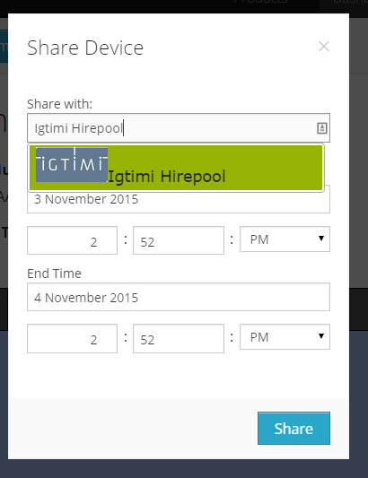

# How do I lend a unit to a friend?

This article assumes that you have a YachtBot account, your friend does, too, and you are already contacts on YachtBot.

If you're lending a unit to a friend, you are giving them temporary access to it so that they can use it as if it's theirs. On YachtBot, this simply means sharing the device with them. On your device list, select the device you're planning to give, or have already given them and select 'Share Device'. Here, you type in their name or email address and then select them from the drop down list.

Select a start and end date and time and click Share.

Note that the sharing window can be in the past, spanning the present, or be fully in the future. Sharing devices cannot be undone, but you can create multiple overlapping sharing windows without any harm.
