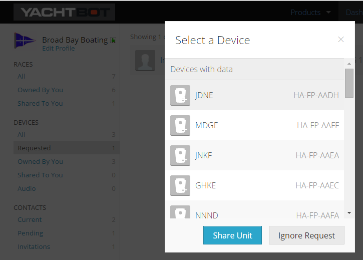

# Sharing data with your friends

Sailing is best done with your best friends, and YachtBot makes most sense when all boats are shown together. In this article, we assume that you and your friends are already contacts on YachtBot.

Requesting data from your friends to a race with your device's data already in it is easy, and is covered in the [Getting your race participants' data](../../YachtBot%20Web/Race%20Management/Getting%20your%20race%20participants'%20data.md) article in the 'You request' section. YachtBot doesn't care whether the data has already been recorded or is about to be recorded.

Once your friend logs onto YachtBot, they see a Requested section in their list of devices. They simply select the unit they want to share with you and it's done! For them to see the race you've created, you still need to [share the race](../../YachtBot%20Web/YachtBot%20accounts:%20the%20basics/Sharing%20races:%20Public%20vs.%20private.md) with them.

Note that with a free account, you can only show a maximum of two yachts per race.
