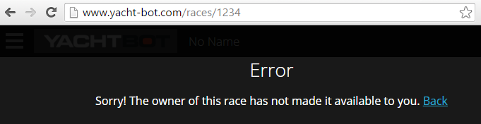

# How do I watch the race as a supporter?

If someone else has already set up a public race and you only want to watch it (either live or in replay mode), simply ask the race owner for the link. It looks like this

www.yacht-bot.com/races/1234

where 1234 is the race's unique number.

Using any web browser (with Chrome preferred), you can follow the action!

### Oh No! Something went wrong?

If the race isn't public, you will see an error. Contact the race owner and ask them to make the race public.

If the race isn't public and that's intentional, then you can only watch the race if the owner shares it with you. For this to work, you need a YachtBot account (it's free!), the owner and you need to become contacts, the race needs to be shared to you, and you need to be logged into Yacht-Bot.com to view it.
