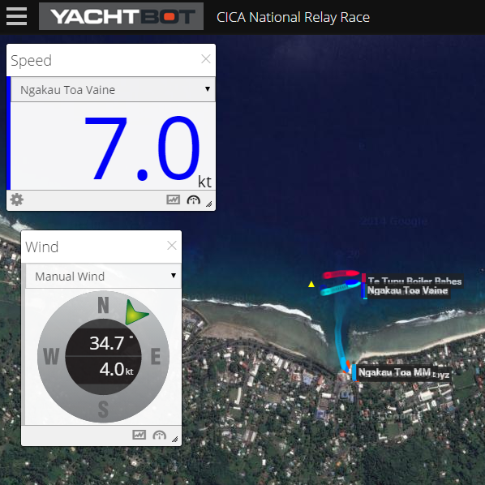
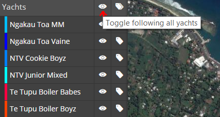
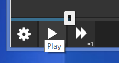
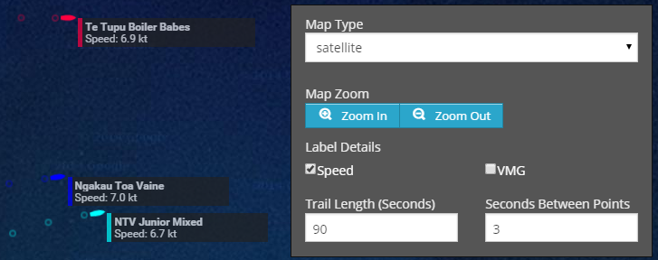
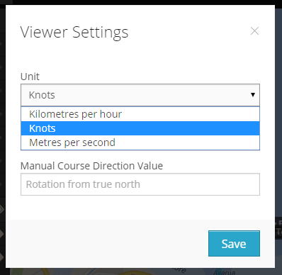

# Tips & Tricks

Want some instruction on how to get the most out of YachtBot viewer? You've come to the right place!

  

Browsers
--------

Web technology is a fast-moving field, and the way we send data from our servers to anyone who's watching is pretty cutting-edge. Therefore, only the latest of all common browsers are supported, and Chrome recommended.

  

Unique link
-----------

Each YachtBot race has a unique race number, with the link taking the form www.yacht-bot.com/races/1234. Recent public races are showcased on our homepage, and if you're ever looking for a race you can't find - get in touch and we'll find it for you.

  

More space!
-----------

Got it all set up as you want it? Make more room for the action by folding the control bar on the left using the main menu (triple bar) on the top left as shown in image on the right.

  

Following and Label toggles
---------------------------

By default, all yachts in the race will be followed, i.e. the map is set to automatic zooming and panning to keep everyone in view. To zoom in on someone in particular, simply unfollow everyone by clicking the top eye icon, then pan and zoom using your mouse or pinching fingers.

  

  

By default, all yachts are labelled with their name. If you find this obstructs your view, you can in the same fashion as with the following, turn off all or specific labels.

  

As you like it
--------------

With YachtBot, you can control your own viewing experience to the last detail. Here is a quick run-through of the most common controls:

  

### Play/Pause and Speed

Located at the bottom left, you can set your playback speed when watching a race in replay mode. Live races, by definition, play at speed x1, though you can scroll back and playback recorded data at a higher rate.

###   

### Time slider

Below the map and above the bottom controls is the time slider, which you can drag around to get to the part of the race you're interested in. Allow a few seconds for data to be loaded from the server. For live races, this slider sits at the very right as data is streaming in.

  

### Label details and trail settings

Using colours to identify the different yachts is set by the race owner. Along with choosing to show the label at all (see above), you can add the speed and VMG numbers to the label.

YachtBot shows the current location in time, and a trail of where the device has been. The length of trail in seconds, and how many seconds between trail points can be set here also.

  

  

  

### Map type

By default, YachtBot shows the data on the background of a roadmap. You can change this to be a satellite image instead by opening the Alter Map Options dialog on the bottom right (globe icon). 

  

### Speed units

Located in the bottom left corner, open the Map Settings. Here you can select between knots, km/h, and m/s for your units. Save to allow change to take effect for speed windows and label details.

  

Other
-----

Also available, but less commonly used is the ability to use a manual course direction in favour of a manual wind. This is useful if you want to see meaningful VMG results without adding wind data. Set this option in the map Settings on the bottom left.