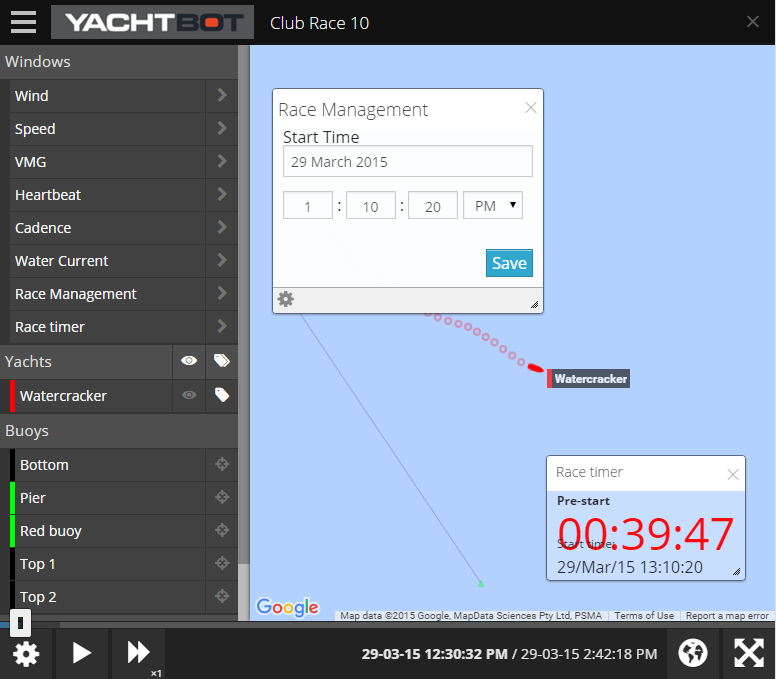

# Editor vs. Viewer

As a race owner, you need to discover the difference between the race editor and viewing the race as the race owner. In both modes, you can make important changes to your race. Why isn't everything getting done in the race editor? Read on to find out!

## Race editor

Here, you set up your race and give it a name, a start and end time, and add your yachts. That's the minimum you need to do. In addition, you can add wind and current devices, buoys and markers. If you're creating a race after the data has been recorded you can see all tracks for all your devices.

## Race viewer

Some settings in YachtBot, most notably the race timer, are set in the viewer. You must be logged in to see the Race Management section on the left hand side. Bring it up, set a race time, and thereby make the race timer available for all your viewers.

