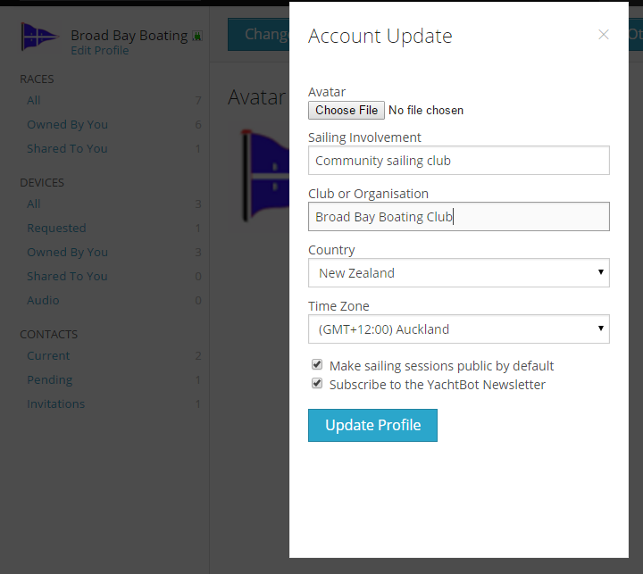

# Profile & Account settings

Setting up your account is one of the first steps to complete when you're new to YachtBot.

At the top right hand corner, select the name you signed up with to see the options. We recommend setting the following options at a minimum:  

  

Avatar
------

Click on 'Update Other Details' and upload an image file. On our homepage, public races will show your name and image. This can be a great way to let the world know about your sailing club or your organisation's activities!

  

Time zone
---------

Setting your time zone correctly impacts on how times are displayed elsewhere on the website. Click on 'Update Other Details' to change the time zone.

  

