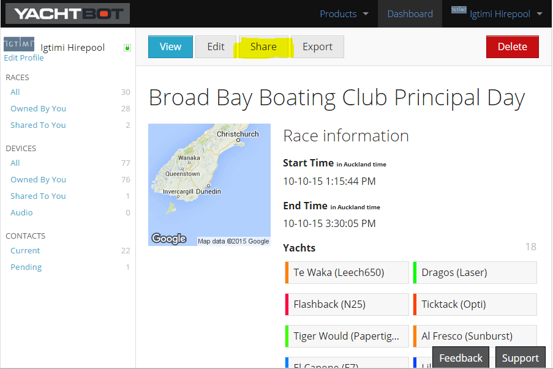
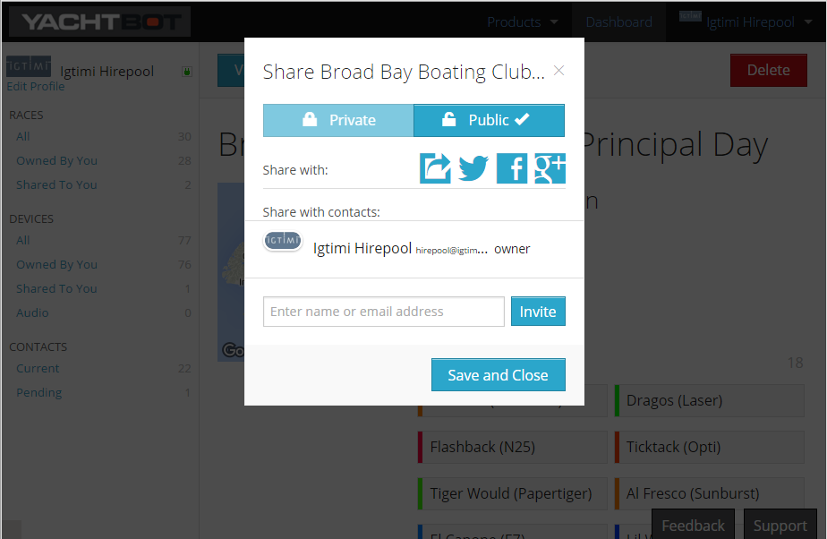

# Sharing races: Public vs. private

Sharing is caring! Most races are meant to be publicly enjoyed, and it that's what you usually want to do, you can set your races to be public by default as part of your profile in your account settings.

  

To change the public/ private status of each race, simply select it from the Dashboard and click on Share.

  

  

There, you can toggle between Private and Public, and share the race by its link or straight away on your favourite social media.

  

TIP! To make sure that your race is public, we recommend opening it in a [Chrome incognito](https://support.google.com/chrome/answer/95464?hl=en) window. This makes sure you’re not logged into YachtBot and none of your stored cookies are used.  

  

  

If you prefer for a race to be private, you can still share it with people on your contact list. See the [Managing Contacts](../../YachtBot%20Web/Getting%20started/Managing%20YachtBot%20Contacts.md) article for how to become someone's contact. After this is done, simply start typing their name or email address in the provided field, select them from the list that appears, and click on Invite.

  

Happy sharing!